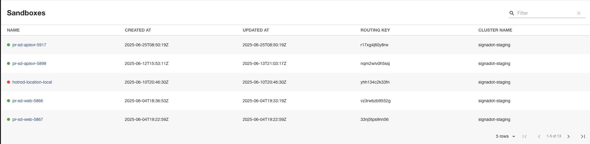
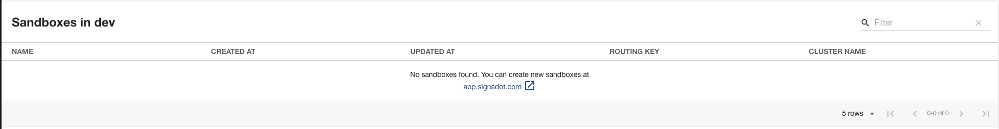
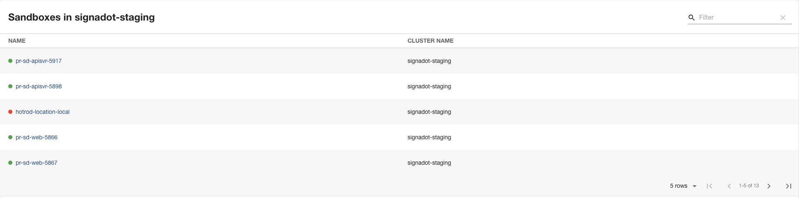
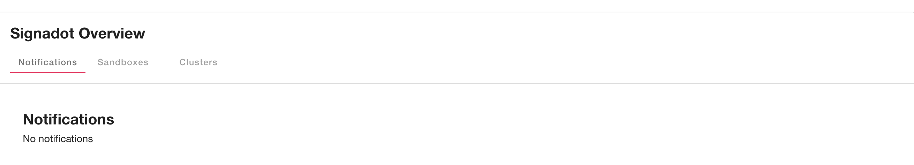
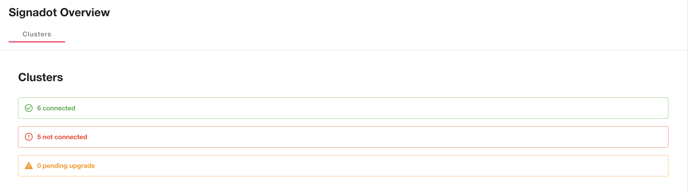
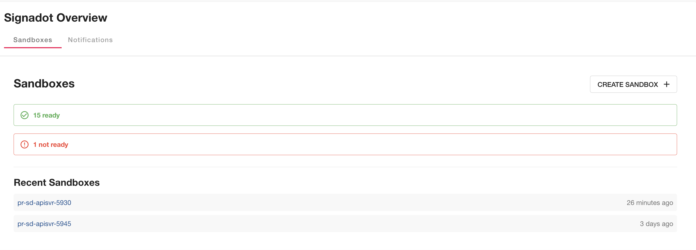

# signadot

Welcome to the signadot plugin!

## Installation

```bash
yarn add --cwd packages/app @signadot-dev/backstage-plugin
```

## Getting started

### Configuration

Add the following to your `app-config.yaml`:

```yaml
signadot:
  org: 'your-organization-name'
  apiKey: 'your-api-key'
```

And also add the following proxy in `app-config.yaml`:
```yaml
proxy:
  endpoints:
    '/signadot':
      target: https://api.signadot.com
      changeOrigin: true
      allowedHeaders:
        - 'signadot-api-key'
```

## Components

### SandboxesCard

The recommended way to use this plugin is to add the `SandboxesCard` component to your existing pages. Here are some examples of how you can use it in your homepage:

#### Default View (All Sandboxes)
```tsx
import { SandboxesCard } from '@signadot/backstage-plugin';

export const HomePage = () => (
  <Grid container spacing={3}>
    <Grid item xs={12}>
      <SandboxesCard />
    </Grid>
  </Grid>
);
```


#### Filtered by Cluster
```tsx
import { SandboxesCard } from '@signadot/backstage-plugin';

export const HomePage = () => (
  <Grid container spacing={3}>
    <Grid item xs={12}>
      <SandboxesCard clusterName="dev" />
    </Grid>
  </Grid>
);
```


#### Custom Columns
```tsx
import { SandboxesCard } from '@signadot/backstage-plugin';

export const HomePage = () => (
  <Grid container spacing={3}>
    <Grid item xs={12}>
      <SandboxesCard columns={["name", "clusterName"]} />
    </Grid>
  </Grid>
);
```


### OverviewCard

The overview component is inteded to show summaries, overviews and more information related to your usage and so on.

##### Default view
```tsx
import { OverviewCard } from '@signadot/backstage-plugin';

export const HomePage = () => (
  <Grid container spacing={3}>
    <Grid item xs={12}>
      <OverviewCard />
    </Grid>
  </Grid>
);
```


##### Clusters Tab Only
```tsx
import { OverviewCard } from '@signadot/backstage-plugin';

export const HomePage = () => (
  <Grid container spacing={3}>
    <Grid item xs={12}>
      <OverviewCard defaultTab="clusters" />
    </Grid>
  </Grid>
);
```


##### Selected Tabs
```tsx
import { OverviewCard } from '@signadot/backstage-plugin';

export const HomePage = () => (
  <Grid container spacing={3}>
    <Grid item xs={12}>
      <OverviewCard tabs={["sandboxes", "clusters"]} />
    </Grid>
  </Grid>
);
```


## Component Props

### SandboxesCard Props

| Prop | Type | Default | Description |
|------|------|---------|-------------|
| `columns` | `Array<"name" \| "createdAt" \| "updatedAt" \| "routingKey" \| "clusterName" \| "labels">` | `undefined` | Customize which columns to display |
| `clusterName` | `string` | `undefined` | Filter sandboxes by cluster name |

### OverviewCard Props

| Prop | Type | Default | Description |
|------|------|---------|-------------|
| `title` | `string` | `"Signadot Overview"` | Custom title for the card |
| `sandboxes` | `{ maxRecentSandboxes?: number }` | `{ maxRecentSandboxes: 5 }` | Configuration for the sandboxes tab |
| `tabs` | `Array<"notifications" \| "sandboxes" \| "clusters">` | `["notifications", "sandboxes", "clusters"]` | Specify which tabs to show |

## Local Development

You can serve the plugin in isolation by running `yarn start` in the plugin directory.
This method of serving the plugin provides quicker iteration speed and a faster startup and hot reloads.
It is only meant for local development, and the setup for it can be found inside the [/dev](./dev) directory.
